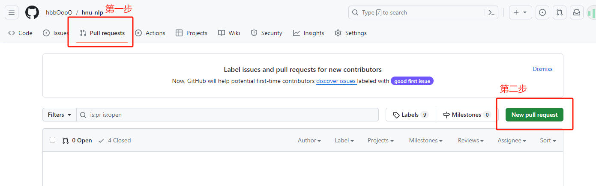
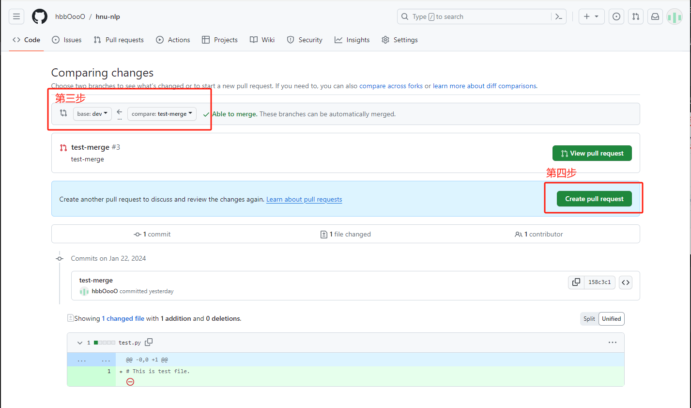
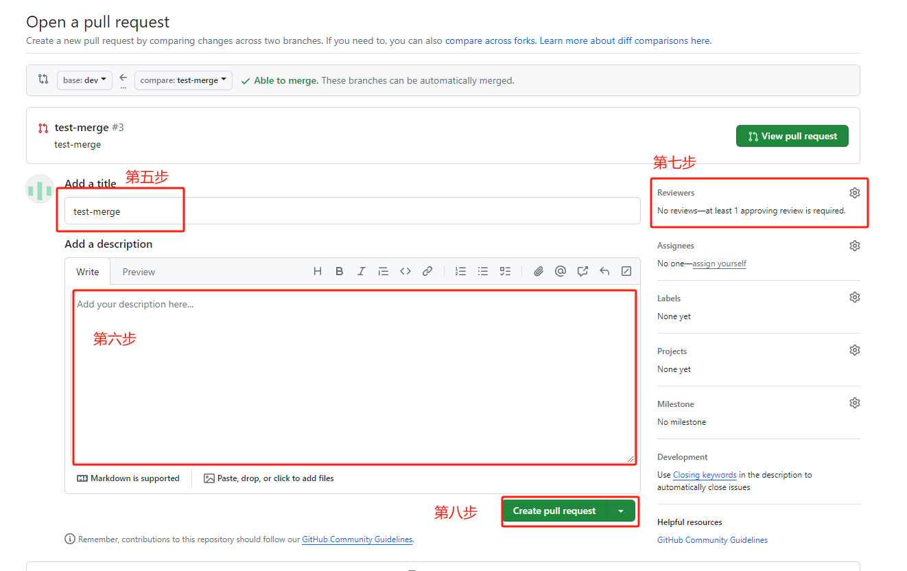

# 项目管理规范


master(main)分支：用于存放稳定的代码，用于发布。不允许直接推送到该分支上。

develop(dev)分支：用于存放经过前沿测试的代码。可以合并到master分支中去。不允许直接推送到该分支上。

feature/bugfix分支：用于存放新特性/Bug修复的代码。可以合并到develop分支中去。允许自行创建该分支，允许直接推送到该分支上。

reference分支：参考代码，这个是之前开发的代码，仅供参考，不与其他分支合并。

开发时，在本地调试通过后，需要存放到新的feature/bugfix分支。推送到远程仓库中，发起PR(Pull Request)请求到dev分支，选择韩明杰或其他人为viewer。评审通过后可以进行合并。

评审目的：一人编写代码，多人检查代码。避免代码中出现注释遗漏、拼写错误、类型错误；也有助于其他人理解代码。

评审内容：代码风格上的建议、代码不清楚的地方、代码难懂的地方、代码拼写上的错误等。

# 项目进度规划

一、	美化代码风格

**添加函数注释**。以base_dataset.py为例，必须添加的注释如“函数输入、输出的类型、释义”“函数功能介绍”“文件头部日期、作者、描述”，可选添加的注释如“复杂代码的行内注释”、“类注释”。

**减少隐式参数调用**。以base_dataset.py为例。_read()方法需要路径，使用self.data_paths可读性不高，需要将data_paths作为参数输入，增加可读性。

美化的路线如下：
1. 基本数据集(`common/datasets/base_dataset.py`)、基本模型(`commom/models/base_model.py`, `common/classification_model.py`, `common/generation_model.py`)、模块(`common/module/auto_net.py`)、基本处理器(`common/processors/base_processor.py`, `common/processors/test_processor.py`)、损失函数(`common/losses.py`)、评价指标(`common/meters.py`)、优化器(`common/optimizer.py`)、日志(`common/logger.py`)、计时器(`common/timer.py`)、检查点(`common/checkpoint.py`)、YML读取器(`common/yml_loader.py`)、设置覆盖(`config_overwrite.py`)、collate函数复写(`collate.py`)等其他运行trainer所必须的子功能；
2. 美化trainer与run.py；
3. 以情感分类任务为例，在具体任务上运行并调试成功；

二、	补充其他功能


待定。。。


# 时间表

|  内容   | 完成时间  |
|  ----  | ----  |
| 基本数据集  | 2024/1/23 |
| 基本模型  | &#10008; |
| 模块  | &#10008; |
| 基本处理器  | &#10008; |
| 损失函数  | &#10008; |
| 评价指标  | &#10008; |
| 优化器  | &#10008; |
| 日志  | &#10008; |
| 计时器  | &#10008; |
| 检查点  | &#10008; |
| YML读取器  | &#10008; |
| 设置覆盖  | &#10008; |
| collate函数复写  | &#10008; |
| trainer  | &#10008; |
| run  | &#10008; |
| 情感分类  | &#10008; |

# 开发流程

1. 准备最新的dev分支

若没有clone过本项目，则执行下面语句：
```
git clone https://github.com/hbbOooO/hnu-nlp.git --branch dev
```

若已经clone过dev分支，则执行下面的语句，从远程分支中拉取最新的dev分支，并更新本地dev分支：
```
git checkout dev
git pull origin dev
```

2. 创建新的分支，名字自定义，能表示自己这个分支里面做的主要的改动。比如，这里命名为`feature-A`
```
git checkout -b feature-A
```

3. 根据远程仓库中的reference分支中对应的py文件，美化代码，增加注释。

4. 暂存代码。这个命令可以多次执行，如果代码没有暂存时切换分支，那么已经做的改动就会丢失。
```
git add .                   # "." 表示所有的代码
```

5. 在本地提交一次代码。本地也可以提交多次。
```
git commit -m "B"           # B 表示提交时的信息，用来说明这次提交的内容
```

6. 当本地修改好之后，将本地分支推送到远程仓库中。
```
git push origin feature-A   # 这里的"feature-A"与之前的要保持一致
```

7. 发起一次PR请求，步骤如下：





①点击"Pull Request"

②点击"New pull request"

③选择你的分支Merge到Dev分支

④点击"Create pull request"

⑤输入PR标题

⑥输入PR的描述，主要阐述一下PR改动的主要内容

⑦添加其他3个人为Viewer

⑧点击"Create pull request"

# 评审教程

等待完成。。。

