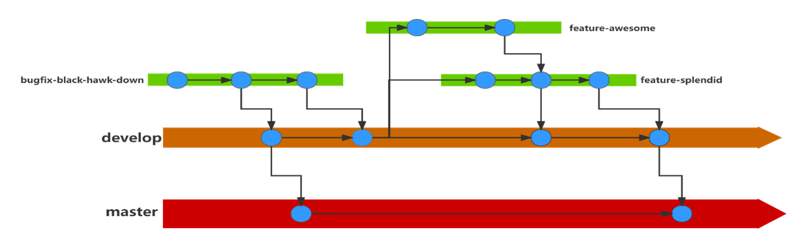

# 项目管理规范

master(main)分支：用于存放稳定的代码，用于发布。不允许直接推送到该分支上。

develop(dev)分支：用于存放经过前沿测试的代码。可以合并到master分支中去。不允许直接推送到该分支上。

feature/bugfix分支：用于存放新特性/Bug修复的代码。可以合并到develop分支中去。允许自行创建该分支，允许直接推送到该分支上。

reference分支：参考代码，这个是之前开发的代码，仅供参考，不与其他分支合并。

开发时，在本地调试通过后，需要存放到新的feature/bugfix分支。推送到远程仓库中，发起PR(Pull Request)请求到dev分支，选择韩明杰或其他人为viewer。评审通过后可以进行合并。

评审目的：一人编写代码，多人检查代码。避免代码中出现注释遗漏、拼写错误、类型错误；也有助于其他人理解代码。

评审内容：代码风格上的建议、代码不清楚的地方、代码难懂的地方、代码拼写上的错误等。

# 项目进度规划

一、	美化代码风格

**添加函数注释**。以base_dataset.py为例，必须添加的注释如“函数输入、输出的类型、释义”“函数功能介绍”“文件头部日期、作者、描述”，可选添加的注释如“复杂代码的行内注释”、“类注释”。

**减少隐式参数调用**。以base_dataset.py为例。_read()方法需要路径，使用self.data_paths可读性不高，需要将data_paths作为参数输入，增加可读性。

美化的路线如下：
1. 基本数据集、基本模型、模块、基本处理器、损失函数、评价指标、优化器、日志、计时器、检查点等其他运行trainer所必须的子功能；
2. 美化trainer与run.py；
3. 以情感分类任务为例，在具体任务上运行并调试成功；

二、	补充其他功能

待定。。。

# 时间表

|  内容   | 完成时间  |
|  ----  | ----  |
| 基本数据集  | &#10008; |
| 基本模型  | &#10008; |
| 模块  | &#10008; |
| 基本处理器  | &#10008; |
| 损失函数  | &#10008; |
| 评价指标  | &#10008; |
| 优化器  | &#10008; |
| 日志  | &#10008; |
| 计时器  | &#10008; |
| 检查点  | &#10008; |
| trainer  | &#10008; |
| run  | &#10008; |
| 情感分类  | &#10008; |

